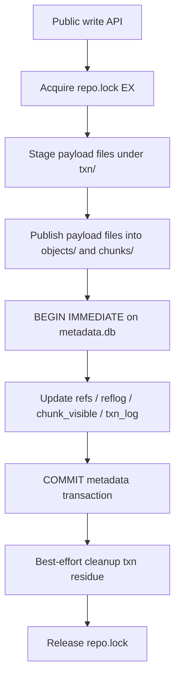

# 10. Phase 14 Reachable-State Durability 与 Metadata 事务化重构

## Goal

在 Phase 13 已完成当前时间路径热点收敛之后，用新的“可达状态安全”和“全局可串行化”定义重新审视 `backend.py` 的断电/崩溃语义、Windows 耐久性边界、同进程/跨进程/跨节点并发边界、metadata fan-out 成本和后续可替换依赖，明确下一轮应先做哪些安全硬化，再做哪些重构与性能收益回收。

## Status

已完成。

当前交付以 Phase 14 MVP 的运行时安全收口为准：

- 全局锁统一为 repo-root 内单一 `repo.lock` shared/exclusive 文件锁，当前实现使用 `portalocker`。
- 同进程线程、同机多进程和共享路径访问都走同一套文件锁协议，不再混用额外的进程内锁路径。
- 已补公开回归覆盖同进程线程串行化、正常仓库 zip/unzip 直启，以及带中断事务残留仓库 zip/unzip 后直接恢复启用。
- metadata 事务化的大重构仍保留为后续收益项，但不再阻塞 Phase 14 的 reachable-state safety、serializability 与 zip 级可移植交付。
- Phase 14 剩余的分析/评估/调研工作现已补齐：默认 metadata substrate、Windows/NFS 边界、依赖取舍、schema 草案、迁移路径和下一步实现顺序都已定稿。
- 文档中仍保留少量未勾选项，它们代表后续实现/自动化回归工作，而不是本轮分析缺口。

## 为什么需要 Phase 14

当前实现已经通过了 Phase 8 的公开 failpoint 基线，但最新复盘表明，下一轮工作的判断标准需要更精确：

- `create_commit.after_publish`
  中断后旧 head 保持可读、旧文件内容保持正确、`quick_verify()` / `full_verify()` 继续通过，但可能留下 `txn/` 残留和不可达孤儿对象。
- `create_commit.after_ref_write` / `create_commit.after_reflog_append`
  当前 ref-changing 路径已经能把可达状态回滚到旧 head，不会把半提交 ref 暴露给后续读取。
- `gc.after_publish`
  中断后 live 主状态保持可读，校验继续通过；留下的只是可回收垃圾和待清理事务目录，而不是可达真相损坏。
- 这意味着 Phase 14 不应再把“有孤儿对象/残留事务目录”视为 correctness 失败，而应把注意力集中到：
  可达数据是否可能损坏；
  Windows / 断电语义是否足够硬；
  同进程线程、同机多进程和跨节点共享路径访问是否都保持可串行化；
  当前自定义 metadata / manifest / small-file durability 协议是否值得继续维护。

## 新的损坏定义

Phase 14 统一采用下面这套判断标准。

### 视为数据损坏

- 任意可达 ref 指向的 commit closure 无法完整读取。
- 任意可达 tree/file/blob/chunk 在公开 API 下出现读失败、校验失败、内容不一致或 hash 不一致。
- 可达文件的 `oid` / `sha256` / size / range read 与实际字节不一致。
- `quick_verify()` / `full_verify()` 在只检查正式可达仓库真相时发现错误，而不是仅发现缓存或垃圾残留。
- 仓库在重开后把 ref 指向一个缺对象、缺 pack、缺 chunk index 的半提交状态。

### 不视为数据损坏

- 不可达孤儿对象。
- `txn/` 残留目录，只要它不让可达主状态失真。
- `cache/files/`、`cache/snapshots/`、detached view 被用户改坏或丢失。
- `gc()` / `squash_history()` 中断后留下的可回收垃圾、待隔离文件或未完成清理痕迹。
- 任何后续可以由 `gc()`、恢复逻辑或显式 maintenance pass 清掉、且不污染可达主状态的残留。

### 对应的公开语义

- 对 ref-changing 写路径：
  如果 API 没有明确成功返回，则对调用方可达的 ref/tree/file 语义必须等效于“旧状态仍然成立”，不能出现第三种半提交可见态。
- 对 storage-only 维护路径：
  允许留下不可达垃圾，但不允许让可达主状态产生读错、缺块、错 hash 或 ref 漂移。
- 对 verify / diagnose 路径：
  应明确区分“reachable corruption”与“reclaimable residue”，不能把两者混成同一类错误。

## 全局可串行化定义

Phase 14 同时把线程安全和进程安全提升为和 reachable-state safety 同级的硬约束。

### 必须覆盖的并发范围

- 同一 Python 进程内的多个线程同时调用同一个或不同的 `HubVaultApi` / backend 实例。
- 同一台机器上的多个 Python 进程或 CLI 进程同时访问同一个 repo root。
- 不同机器上的进程通过共享路径访问同一个 repo root，例如 repo root 位于 NFS、SMB 或其它网络挂载路径上。

### 可串行化要求

- 任意一组公开 API / CLI 操作的执行结果，都必须等价于某个单线程全序串行执行。
- 写操作必须有唯一线性化点；成功返回的写操作必须在该点之后对后续读可见，失败或中断的写操作不能留下可达半提交状态。
- 读操作可以并发，但每次读只能观察到一个完整 committed snapshot，不能混合读到同一写操作前后的部分状态。
- 两个并发写操作必须串行化；不能出现 lost update、双 head、reflog 顺序和 ref 顺序不一致、chunk index 可见顺序错乱等结果。
- 维护操作 `gc()` / `squash_history()` 必须与普通写操作串行化；它们可以留下不可达垃圾，但不能删除任何在其线性化快照中可达或并发写入后会变成可达的对象。
- 可串行化要求不因运行位置变化而放宽：线程内、同机多进程、跨节点共享文件系统访问都必须满足同一语义。
- 仓库可搬迁要求也不因运行位置变化而放宽：repo root 必须始终是完整真相，可以直接 `zip` 打包、搬到任意机器或路径、解压后立刻打开使用，不允许额外恢复、注册、初始化或 sidecar 补全步骤。

### 选型约束

- 不能只依赖进程内 `threading.Lock` 之类机制，因为它无法覆盖多进程和跨节点。
- 不能假定当前 host-local 文件锁、SQLite 默认锁模式或任意第三方库在 NFS/SMB 上天然满足要求；必须查明官方语义并用跨节点实验验证。
- 如果某个 metadata substrate 或锁方案只能保证单机可串行化，不能作为 Phase 14 默认方案，除非实现额外的共享路径可串行化层。
- 若某类网络文件系统无法提供必要的锁和原子 rename / durability 语义，代码必须显式拒绝进入多节点写入模式，不能静默降级到不安全行为。

## 当前代码结论

基于 `backend.py` 当前实现与已跑过的 failpoint / profiling 复盘，Phase 14 之前的状态可以总结为：

- 当前事务状态机已经足够保证“可达 ref 真相不暴露半提交状态”。
- 当前实现尚不能严格证明“Windows 上断电后仍绝不会出现可达损坏”。
- 当前全局锁已统一收敛为 repo-root 内单一 `repo.lock` shared/exclusive 文件锁；同进程线程、同机多进程和共享路径访问都走同一套文件锁协议。
- 当前最值得重审的不是 merge/tree 算法，而是 metadata 与 durability 协议本身。
- 当前最重的写侧热点主要是 `fsync` fan-out 和 metadata 小文件写入，不是核心算法复杂度。
- 当前最重的读侧基础设施热点主要是 chunk visible-index 构建与 metadata fan-out，不是 warm download 本体。

当前已知的主要风险点如下：

- `_fsync_directory()` 仍是 best-effort，Windows 上目录项耐久性无法被当前实现严格证明。
- 当前跨节点共享挂载访问继续依赖同一个 `repo.lock` 文件锁协议；后续如果发现特定文件系统的锁语义不足，应在该文件系统级别补实测与兼容说明，而不是退回进程内锁混搭。
- `create_repo()` bootstrap 不是完整事务化流程，初始化边界仍有进一步收紧空间。
- chunk index 仍是自定义 `MANIFEST + JSONL segment`，事务性、读放大和后续优化空间都不够理想。
- commit/tree/file/blob metadata 仍由大量小 JSON 文件组成，既带来 durability 成本，也带来 metadata-heavy 性能开销。

## Backend 热点拆解

从 `backend.py` 当前结构看，真正压住 Phase 14 的不是单一算法，而是 metadata substrate 本身：

- 写路径：
  `create_commit()` / `merge()` / `reset_ref()` 都先走 staged transaction，再由 `_publish_staged_objects()` 把对象、pack、index segment、manifest 一个个 `os.replace()` 进正式路径，并对每个目录边界重复 `_fsync_directory()`。
  这类“多小文件发布 + 多次目录 fsync”是当前 small-batch commit 与 metadata-heavy 写路径的主成本。
- 读路径：
  `_snapshot_for_commit()` / `_snapshot_for_tree()` 仍会递归 materialize 全量树快照，merge、listing、某些 copy/delete 路径会反复触发。
- chunk metadata 路径：
  `IndexStore.visible_entries()` 会把当前 visible segment 全量读出成 map，`lookup()` 也会按 manifest/segment 顺序反复扫 JSONL segment。
  因此当前 large-file 数据面已经不算太差，但 metadata 侧仍有明显 fan-out 与读放大。
- 初始化路径：
  `create_repo()` 现在已经被 repo 写锁保护，也会创建初始 commit，但 bootstrap 仍是“创建目录 + 写 repo config + 写空 manifest + 写 ref + 初始 commit”这一串多文件动作，不是单一 metadata transaction。

## 官方资料与本机实验结论

### 外部资料结论

- SQLite 官方明确不推荐直接把数据库放在 network filesystem 上；如果必须使用，共享网络访问应优先考虑 rollback journal，而不是 WAL。
- SQLite 官方同时明确指出 WAL 依赖共享内存，因此所有访问进程必须位于同一台 host；这与 Phase 14 的跨节点共享路径要求不兼容，所以 WAL 不能作为默认方案。
- SQLite rollback-journal 路径的提交语义和 `journal_mode=DELETE` / `synchronous=EXTRA` 官方定义都比较清楚，适合在 repo-local 外层文件锁之下充当 metadata transaction substrate。
- py-lmdb 官方文档说明它依赖 memory map 与独立 lock file；还明确提示“同一进程多次打开同一个 LMDB 文件”是 serious error。
- py-lmdb 还要求如果关闭内建 locking，就必须由调用方自己保证 single-writer / no-reader 冲突；这与当前“同进程多个 backend 实例都可能存在”的使用方式天然冲突。
- 依赖版本方面，当前活跃版本的 `lmdb` 需要 Python `>=3.9`，`zstandard` / `backports.zstd` 需要 Python `>=3.9`，`pyzstd` / `orjson` / `msgspec` 需要 Python `>=3.10`。
  这意味着只要还坚持 Python 3.7/3.8 兼容，压缩与 codec 类依赖基本都不能作为默认方案。

官方资料链接：

- SQLite use over network: <https://www.sqlite.org/useovernet.html>
- SQLite WAL: <https://www.sqlite.org/wal.html>
- SQLite PRAGMA: <https://www.sqlite.org/pragma.html>
- SQLite atomic commit: <https://www.sqlite.org/atomiccommit.html>
- py-lmdb docs: <https://lmdb.readthedocs.io/en/release/>
- PyPI `lmdb`: <https://pypi.org/project/lmdb/>
- PyPI `zstandard`: <https://pypi.org/project/zstandard/>
- PyPI `backports.zstd`: <https://pypi.org/project/backports.zstd/>
- PyPI `pyzstd`: <https://pypi.org/project/pyzstd/>
- PyPI `orjson`: <https://pypi.org/project/orjson/>
- PyPI `msgspec`: <https://pypi.org/project/msgspec/>

### 本机 benchmark 侧结论

结合本机已跑出的 Phase 12 benchmark，可以先把“大头矛盾”定性清楚：

| 场景 | 本机结果 | 结论 |
| --- | --- | --- |
| `large_upload` | `50.68 MiB/s` | 数据面写入已经可用，但离 host-local 顺序写仍有差距 |
| `large_read_range` | `312.21 MiB/s` | 范围读热点不在 Python 循环本身，而更多在基础设施与 I/O 条件 |
| `small_batch_commit` | `3.04 s / 128 files` | metadata 写放大依然很重 |
| `history_deep_listing` | `22.95 s` wall clock | 历史与 metadata 遍历仍昂贵 |
| `hf_hub_download_warm` | `cache_amplification = 0.0` | detached view / warm cache 语义已经健康 |

当前 benchmark 支持的判断是：

- 数据面并不是 Phase 14 第一优先级。
- 读写 correctness 与性能的共同交叉点仍然是 metadata fan-out、manifest/index materialization 和多文件 durability 协议。

### 本机 metadata substrate 小实验

为了避免只靠主观判断，本轮额外跑了一组同口径微基准：

- 环境：本地 `./venv/bin/python`，CPython `3.10.1`
- 工作负载：`3000` 条 metadata 记录，每条约 `512 B` JSON payload
- 写路径：一次完整 durable 批量写入
- 读路径：`15000` 次随机 point lookup，并对 payload 做同口径 JSON decode
- 轮次：`3` 轮取中位数

| 路线 | durable 配置 | 写入 ops/s | 读取 ops/s | 文件数 | 落盘体积 | 结论 |
| --- | --- | --- | --- | --- | --- | --- |
| 当前文件协议 | temp + replace + file fsync + dir fsync | `249.9` | `8,399.5` | `3000` | `1.44 MiB` | 主要成本是小文件与目录 fsync 风暴 |
| SQLite | `DELETE + FULL` | `93,814.4` | `25,404.1` | `1` | `1.73 MiB` | 即便用保守 durability 设置，也比当前写快约 `375x` |
| SQLite | `DELETE + EXTRA` | `126,324.2` | `35,681.7` | `1` | `1.73 MiB` | 推荐 durability 配置的 spot-check，优势仍是数量级级别 |
| LMDB | `sync + metasync + lock` | `167,302.7` | `92,376.3` | `2` | `1.98 MiB` | 本地最快，但优势并没有大到足以覆盖兼容/运维风险 |

相对提速图：

```text
Write speedup vs current file protocol
current file/json       1.0x |█
sqlite DELETE/FULL    375.4x |██████████████████████
sqlite DELETE/EXTRA   505.4x |██████████████████████████████
lmdb sync             669.4x |████████████████████████████████████████

Read speedup vs current file protocol
current file/json       1.0x |█
sqlite DELETE/FULL      3.0x |████████
sqlite DELETE/EXTRA     4.2x |███████████
lmdb sync              11.0x |████████████████████████████
```

这个实验给出的结论很明确：

- metadata substrate 的收益远大于 codec 微优化。
- 只要把“多文件 durable metadata 协议”换成单一事务层，哪怕是保守配置的 SQLite，也已经能回收几百倍写入吞吐量。
- LMDB 的本地极限性能确实更高，但相对 SQLite 的增益只剩 `1.3x` 左右写入和 `2.6x` 左右读取，不足以抵消 Python 版本、同进程多实例和共享路径语义上的风险。

## 设计原则

- repo root 继续保持自包含，所有真相仍位于 repo root 内。
- repo root 的自包含要求进一步收紧为“zip 级可移植”：
  一个仓库目录必须可以直接打包、搬走、解压，然后在新位置立即启用；不允许依赖宿主绝对路径、系统注册状态、仓库外 sidecar 文件、外部数据库或额外一次性迁移步骤。
- 以“可达状态安全”优先，而不是以“绝对没有垃圾残留”优先。
- 不做 roll-forward；未完成写入最多留下不可达垃圾，不能补完成提交。
- 所有公开操作必须可串行化；读并发可以保留，但写和维护操作必须有全局线性化边界。
- 优先引入成熟事务语义，而不是继续扩张自定义多文件提交协议。
- 尽量不为了 Phase 14 MVP 抬 Python 版本下限；如无必要，不因局部优化放弃 Python 3.7/3.8 与 Windows。
- 只有当第三方库在安全、性能或维护成本上带来实质收益时才引入。

## 候选依赖与替代评估

| 目标区域 | 当前实现 | 候选依赖 | 可行性 | 主要收益 | 主要风险/成本 | 当前判断 |
| --- | --- | --- | --- | --- | --- | --- |
| metadata / refs / reflog / txn journal | 多文件 JSON + 文本 ref + reflog JSONL | `sqlite3`（stdlib） | 高 | stdlib、跨平台、支持 3.7-3.14、事务语义成熟、可把 metadata fan-out 收束到单一 durable commit | 默认不能用 WAL；跨节点共享路径依然依赖底层文件系统锁/rename/fsync 语义；需要 schema 与迁移重构 | Phase 14 默认方案：继续使用外层 `repo.lock`，内部采用 rollback journal（`DELETE`）+ `synchronous=EXTRA` |
| metadata / refs / reflog / txn journal | 多文件 JSON + 文本 ref + reflog JSONL | `lmdb` | 中 | 本地读写极快、MVCC 读路径强、也可覆盖 index metadata | 最新版本要求 Python `>=3.9`；同进程多次打开同一 DB 是 serious error；共享路径与调用方式约束更苛刻 | 作为备选技术储备保留，但不作为 Phase 14 默认路线 |
| 全局锁 / 串行化层 | repo-root 内单一 `repo.lock` shared/exclusive 文件锁（当前实现：`portalocker`） | 成熟文件锁、数据库事务锁或显式共享 FS lock backend | 已落地 | 统一线程、进程、跨节点线性化边界，并让所有调用方都走同一个文件锁协议 | NFS/SMB 锁语义仍依赖具体挂载与文件服务器实现，后续需要继续积累实测口径 | Phase 14 默认实现 |
| chunk 压缩 | `compression=\"none\"` | `zstandard` / `pyzstd` | 中 | 降低 pack 体积、改善慢盘 I/O | 当前活跃版本已不覆盖 Python 3.7/3.8；而当前大头瓶颈并不在压缩前的数据面 | Phase 14D 再评估；只有在抬版本下限后才考虑默认启用 |
| JSON 编解码 | `json` | `orjson` / `msgspec` | 低 | 某些 metadata-heavy 路径可降 CPU | 当前活跃版本要求 Python `>=3.10`，且收益远小于 metadata substrate 改造 | 明确后置，不纳入 Phase 14 默认方案 |
| Git graph/ref 基础设施 | 自定义 commit/tree/ref 语义 | `dulwich` / `pygit2` | 低 | 可复用部分 Git 语义实现 | 不能解决当前 durability / metadata fan-out 主矛盾，兼容与打包成本高 | 不作为 Phase 14 主线 |

## 推荐重构方向

### 推荐主线：SQLite-first metadata 事务化

Phase 14 默认优先考虑把 repo 内“高频 metadata 真相层”收进一个 repo-local SQLite 数据库，而不是继续扩大自定义文件协议。这里的推荐形态不是“让 SQLite 自己充当分布式并发协议”，而是：

- 继续以 repo-root 内单一 `repo.lock` 作为公开 serializability 边界；
- SQLite 只负责 metadata atomicity / durability / fan-out 收束；
- 默认只用 rollback journal，不用 WAL；
- 跨节点共享路径继续建立在“底层共享文件系统正确实现文件锁、rename 和 fsync 语义”这一前提上。

推荐优先纳入 SQLite 的内容：

- branch/tag refs
- reflog records
- txn state / recovery journal
- chunk visible manifest / chunk index metadata
- 如果原型证明收益明显，再继续纳入 commit/tree/file/blob metadata

保留在文件系统中的内容：

- blob payload bytes
- chunk pack payload bytes
- detached view / snapshot cache
- quarantine 与显式可清理垃圾

这样做的理由：

- `sqlite3` 是标准库，跨平台和 Python 版本覆盖最好。
- refs / reflog / txn state / chunk visible metadata 是当前 correctness 与性能的共同交叉点。
- 即使后续仍保留 pack/blob 外置文件，先把 metadata 统一进事务层，也能显著收敛状态机复杂度和小文件 `fsync` 风暴。
- 使用外层 `repo.lock` 后，SQLite 不再承担“对外并发协议”的职责，只承担单仓 metadata transaction 的职责，更贴合当前需求。
- 如果目标共享文件系统不能稳定提供文件锁、rename 和 fsync 语义，则今天的实现和 SQLite-first 实现都会有边界问题；这类平台应显式标注为 unsupported shared-FS profile，而不是回退到进程内锁。
- 即便引入新的 metadata store，它也必须严格位于 repo root 内，并且仓库在 zip/unzip 后不需要额外 rebuild、VACUUM、attach 或 re-register 才能重新启用。

### 默认配置定稿

如果按 SQLite-first 落地，Phase 14 默认配置定为：

- 外层串行化锁：继续使用 `locks/repo.lock`
- journal mode：`DELETE`
- synchronous：`EXTRA`
- temp store：`MEMORY`
- WAL：默认禁用
- 连接生命周期：每次公开 API 调用在持锁期间创建短生命周期 connection，不共享长期 connection，不把 sqlite connection 作为跨线程共享状态

这套配置的含义是：

- 线性化点仍由 `repo.lock` 控制，满足“所有锁都走文件锁”的约束。
- metadata 真相的 commit 点落在 SQLite transaction commit，而不是多个 JSON/ref/reflog 文件分别 publish。
- 如果进程在 payload publish 之后、metadata commit 之前中断，留下的只是不可达 payload residue，不是可达损坏。
- 如果进程在 metadata commit 之后中断，新的可达 metadata 已经建立，后续只需 best-effort 清理 `txn/` residue。
- `create_repo()` 也不再是“写几个基础文件再补一个初始 commit”的松散流程，而是“建立目录骨架 -> 初始化 metadata schema -> 在单一 metadata transaction 内写 repo meta、default branch 和 initial commit truth”。

### 可接受的渐进式切分

Phase 14 不要求一步把所有 metadata 一次性搬进数据库。建议按收益和风险分层：

- Tier 1：
  `refs + reflog + txn journal + chunk visible manifest/index metadata`
- Tier 2：
  `commit/tree/file/blob metadata`
- Tier 3：
  chunk compression、JSON codec、更多 OS-specific I/O 手段

### 需要明确的现实边界

即便采用 SQLite-first，若 blob/pack payload 仍保留为外部文件，Windows 上“断电后 payload 文件 rename 和目录项已稳定持久化”的证明仍不能完全跳过。

因此 Phase 14 应把问题拆开：

- 先用事务化 metadata 把当前 correctness / 性能 / 维护复杂度最大的部分压下去。
- 同时把全局可串行化锁边界纳入 metadata substrate 选型，不能只看本机单进程 benchmark。
- 再决定是否需要进一步做 payload 激活协议、payload journal，或更激进的 payload 存储重构。

## Metadata 事务化设计定稿

在不修改公开 API 语义的前提下，Metadata 事务化 MVP 的设计边界已经定稿如下。

### 推荐 schema 草案

Tier 1 先只覆盖最值钱、最容易出 fan-out 的元数据真相层：

| 表 / 视图 | 主键 | 主要字段 | 用途 | 是否进入 MVP |
| --- | --- | --- | --- | --- |
| `repo_meta` | `key` | `value_json` | `format_version`、`default_branch`、feature flags、schema version | 是 |
| `refs` | `ref_name` | `ref_kind`、`commit_id`、`updated_at` | branch/tag 真相层 | 是 |
| `reflog` | `seq` | `ref_name`、`old_head`、`new_head`、`message`、`created_at`、`checksum` | reflog 顺序与审计 | 是 |
| `txn_log` | `txid` | `op_kind`、`state`、`branch_name`、`old_head`、`new_head`、`created_at`、`committed_at`、`residue_path` | 调试、诊断、residue cleanup，不作为外层 correctness 锁协议 | 是 |
| `chunk_visible` | `chunk_id` | `pack_id`、`offset`、`stored_size`、`logical_size`、`compression`、`checksum`、`published_txid` | 当前 visible chunk index 真相层 | 是 |
| `chunk_segments` | `segment_id` | `level`、`created_at`、`source_txid`、`entry_count` | 只在需要保留 compaction lineage 时使用 | 可选 |
| `objects_commits` | `object_id` | `payload_json`、`git_oid`、`created_at` | commit object 元数据 | Tier 2 |
| `objects_trees` | `object_id` | `payload_json` | tree object 元数据 | Tier 2 |
| `objects_files` | `object_id` | `payload_json` | file object 元数据 | Tier 2 |
| `objects_blobs` | `object_id` | `payload_json`、`data_path` | blob metadata；payload bytes 仍在外部文件 | Tier 2 |

选择这套 Tier 1 切分的原因是：

- 可以先把 refs/reflog/txn/chunk visible metadata 收进一个真正事务层，立刻解决最痛的 fan-out。
- commit/tree/file/blob object 仍然可以保留现有内容寻址对象格式，避免第一轮迁移过大。
- `quick_verify()` / `full_verify()` 后续也更容易把“reachable corruption”与“reclaimable residue”分开报告。

### 推荐读写蓝图



关键语义：

- 真正的线性化点是 `metadata.db` 的 commit，不是 payload 文件 publish。
- payload 文件先 publish、metadata 后 commit，可以把中断结果收敛到“不可达 residue”，符合新的损坏定义。
- 读路径只需要：`repo.lock` shared -> readonly SQLite snapshot -> 按 metadata 解析 payload 文件，不再反复 materialize 全量 visible index。

### 推荐迁移策略

| 步骤 | 动作 | 目的 |
| --- | --- | --- |
| Step 1 | 在 repo root 新增 `metadata.db`，schema version 单独记录在 `repo_meta` | 保持仓库自包含 |
| Step 2 | 持有 `repo.lock` EX，一次性导入 refs、reflog、chunk manifest/index metadata | 建立事务化真相层 |
| Step 3 | 迁移完成后把旧 ref/reflog/manifest 文件降级为 migration residue 或直接移除 | 避免双真相源 |
| Step 4 | 读路径先改到 SQLite；写路径保持 payload 文件 staging/publish，但 metadata 改走 SQLite transaction | 优先回收 correctness 与性能收益 |
| Step 5 | 稳定后再决定是否把 commit/tree/file/blob metadata 纳入 Tier 2 | 控制重构爆炸半径 |

迁移原则：

- 不引入仓库外 sidecar。
- 不要求解压后首次打开先跑手工 repair。
- 不要求后台 rebuild 或 attach。
- 迁移必须在 repo write lock 内完成；失败时要么仍保持旧格式可读，要么保持新格式已完整落盘，不能暴露双真相半状态。

### Windows / 共享路径边界定稿

- 已证明或基本可接受：
  repo-local 文件锁协议、rollback-only ref 语义、zip/unzip 后直接重开、同进程/同机多进程串行化。
- 尚未被严格证明：
  Windows 上目录项 durability，尤其是 `_fsync_directory()` 的 best-effort 边界；
  任意 NFS/SMB 组合上的 lock/rename/fsync 语义。
- 因此默认工程策略不是“宣称所有共享文件系统都绝对安全”，而是：
  代码只实现单一文件锁协议；
  文档与验收脚本明确 shared-FS compatibility profile；
  对语义不达标的共享文件系统显式标 unsupported，而不是静默降级。

## Phase 14A. Reachable-State 语义收口与实验基线

### Goal

把新的损坏定义、校验语义和异常测试口径先收口，确保后续重构不会继续被“是否留下孤儿对象”这种问题误导。

### Status

部分完成。

新的 reachable-state 定义、并发/迁移矩阵和公开语义已经收口，并已有基础公开回归；`VerifyReport` 分类细化与更完整 failpoint 套件仍待后续代码阶段补齐。

### Todo

* [x] 把计划文档、测试命名和异常安全说明统一改成“reachable-state safety”口径。
* [x] 明确区分 ref-changing 写路径与 storage-only 维护路径的异常判定规则。
* [x] 为 `quick_verify()` / `full_verify()` / `get_storage_overview()` 补一套预期分类：reachable corruption、reclaimable residue、cache damage。
* [ ] 用公开 API 固化一组新的 failpoint 复盘脚本，至少覆盖 `create_commit.after_publish`、`after_ref_write`、`after_reflog_append`、`merge.after_publish`、`gc.after_publish`。
* [x] 记录 Linux 与 Windows 两套最低可接受语义，不再把尚未证明的强断电语义直接写成“已成立”。
* [x] 固化同进程多线程、同机多进程、跨节点共享路径三类可串行化测试矩阵。
* [x] 固化 zip 打包迁移测试矩阵：关闭状态直接打包、换路径解压、换机器/换挂载点后直接打开，不允许额外初始化步骤。

### Checklist

* [x] 计划文档不再把“存在不可达孤儿对象”误写成数据损坏。
* [x] 对 ref-changing 路径，期望仍明确为“可达状态要么旧、要么新”。
* [x] 对 storage-only 路径，期望明确为“允许留垃圾，但不允许 reachable truth 出错”。
* [x] `quick_verify()` / `full_verify()` / `get_storage_overview()` 的角色边界在文档中清楚区分。
* [ ] 公开并发测试能证明读看到完整快照，写与写、写与维护操作都有唯一串行化顺序。
* [x] 公开迁移测试能证明仓库 zip/unzip 后可直接启用，无需仓库外 state 或额外恢复动作。

## Phase 14B. Metadata Substrate 选型与 Windows Durability 复盘

### Goal

在真正改实现前，把最值得替换的模块、第三方依赖、Windows 耐久性风险、跨节点共享路径可串行化风险和迁移边界评估清楚，避免边改边重新选型。

### Status

已完成。

### Todo

* [x] 对 `sqlite3`、`lmdb` 和“继续维护当前文件协议”三条路线做同口径比较，覆盖安全、性能、迁移、Python 版本、Windows 打包成本和跨节点共享 FS 可串行化成本。
* [x] 对当前全局锁语义做同进程、同机多进程和共享路径访问复盘，并把实现统一到单一 `repo.lock` 文件锁协议。
* [x] 查明候选 metadata substrate 在 NFS/SMB 上对锁、journal、atomic rename 和 crash recovery 的官方限制。
* [x] 产出 repo-local metadata schema 草案，至少覆盖 refs、reflog、txn state、chunk visible index。
* [x] 评估 commit/tree/file/blob metadata 是进入同一个 metadata store，还是先保留文件对象格式。
* [x] 补一轮 Windows / NTFS 关注点清单，明确当前 `_fsync_directory()` 和多文件发布协议哪里缺证明。
* [x] 为 `create_repo()` bootstrap 定义更严格的事务边界，不再把初始化视作“写几个文件再补一个 commit”的松散组合。
* [x] 审查所有候选 substrate 是否都满足“repo root 内自包含 + zip/unzip 后直接可用”，不能引入仓库外 sidecar 或首次打开补写步骤。

### Checklist

* [x] 已明确 Phase 14 MVP 的默认 metadata substrate。
* [x] 已明确 Phase 14 MVP 是否需要抬 Python 最低版本；如不需要，应维持现有兼容目标。
* [x] 已明确哪些自定义协议继续保留，哪些由成熟事务层替换。
* [x] 已明确 Windows 上目前“已证明”和“未证明”的 durability 语义边界。
* [x] 已明确同进程线程、同机多进程、跨节点共享路径各自的 serializability 保障机制。
* [x] 已明确所有候选方案在 zip 级可移植性上的成立条件，不允许“需要额外修复后才能启用”的默认方案。

## Phase 14C. Metadata 事务化 MVP

### Goal

落地最小但真实有收益的一轮 metadata 重构，优先同时改善 reachable-state 安全边界、恢复复杂度和 metadata-heavy 性能。

### Status

设计定稿，待实现。

### Todo

* [ ] 在 repo root 内引入统一 metadata store，并保留自包含/可搬迁约束。
* [ ] 将 refs、reflog 和 txn state 接入新的 metadata 事务层。
* [ ] 将 chunk visible manifest / visible index metadata 接入新的 metadata 事务层。
* [ ] 为当前读路径提供新的 metadata adapter，避免每次读取都全量 materialize visible index。
* [ ] 为当前写路径提供新的 metadata commit barrier，减少小文件元数据写入与 `fsync` fan-out。
* [ ] 为所有写 API 和维护 API 定义并实现统一线性化点，确保并发结果可串行化。
* [ ] 为同进程多线程和同机多进程补公开 API 压测，覆盖 lost update、并发 branch update、concurrent gc 与读写交错。
* [ ] 为跨节点共享路径建立可选集成测试或手动验收脚本，至少覆盖两个节点同时写、一个节点写一个节点读、一个节点 gc 另一个节点读写。
* [ ] 重新定义恢复流程：未完成事务最多留下不可达 payload 或待清理 residue，不再依赖大量文件散布的状态痕迹。
* [ ] 在公开 API 下保留现有 detached view、HF-style path suffix 和公开模型语义不变。
* [ ] 为 zip/unzip 后直接启用建立公开回归，覆盖普通路径、含事务残留路径和 shared mount 路径切换后的重新打开。

### Checklist

* [ ] 公开 API 行为、公开模型和 detached view 语义不回退。
* [ ] ref-changing 路径的恢复逻辑比当前更简单，而不是更复杂。
* [ ] `read_range()` / `hf_hub_download()` / `snapshot_download()` 不再依赖昂贵的可见索引全量构建。
* [ ] 小文件 commit / merge / metadata-heavy listing 的主要热点不再是 metadata fan-out。
* [ ] 新实现仍只依赖 repo root 内状态，不依赖外部数据库服务。
* [ ] 同进程、同机多进程和跨节点共享路径都满足同一个可串行化公开语义，或在无法保证的共享 FS 上显式拒绝危险写入模式。
* [ ] 仓库目录在 zip/unzip、换路径、换机器后仍可直接启用，不需要额外 rebuild、attach、迁移或 sidecar 补全。

## Phase 14D. Payload Durability 收口与后续性能项

### Goal

在 metadata 事务化之后，再决定是否需要继续处理 payload 文件激活语义、压缩和更高阶性能项。

### Status

已完成分析，待实现。

### Todo

* [x] 评估 blob/packs 继续作为外部文件时，Windows 上还剩多少未解决的断电证明缺口。
* [ ] 如有必要，为 payload 文件补显式 activation barrier、payload journal 或更严格的 staged publish 协议。
* [ ] 在 metadata 新基线稳定后，重新测 small-batch commit、merge-heavy、full-verify、large-upload、range-read。
* [x] 视收益决定是否引入 `zstandard` / `pyzstd` 做 chunk compression。
* [x] 视 Python 版本策略决定是否引入 `orjson` / `msgspec` 作为局部 codec 优化。

### Checklist

* [x] 已明确 metadata 事务化之后剩余的 reachable-state 风险是否主要来自 payload durability。
* [x] 已明确 chunk compression 是真实收益项，而不是格式复杂度先行。
* [x] 已明确 JSON codec 优化是否值得为之抬 Python 版本下限。
* [x] 所有后续性能项都建立在新的安全口径之上，而不是为了 benchmark 牺牲恢复语义。

## Phase 14 MVP Cut

Phase 14 的最低可接受交付为：

- Phase 14A 完成，新的 reachable-state 安全定义正式生效。
- Phase 14B 完成，metadata substrate 和 Windows durability 边界有清晰结论。
- 至少完成 Phase 14C 的设计闭环：
  metadata schema、迁移策略、读写 adapter 边界、恢复状态机和全局串行化策略都已定稿。
- 已明确并验证 Phase 14 默认方案继续满足“zip 打包搬走，解压后直接启用”的严格自包含约束。

如果实现资源允许，MVP 进一步希望直接落下：

- refs / reflog / txn state / chunk visible metadata 的事务化落地。

## Deferred Items

下面这些内容明确不属于 Phase 14 MVP：

- 全量把所有 payload bytes 直接搬入数据库。
- 用 `dulwich` / `pygit2` 替掉当前主仓库逻辑。
- 因局部 JSON 或 codec 收益而直接抬 Python 版本到 3.9+。
- 异步/并发写入重构。
- 放宽同进程、同机多进程或跨节点共享路径的可串行化语义。
- 为了追 benchmark 结果而改动 detached view、HF-style path suffix 或 rollback-only 公开语义。
